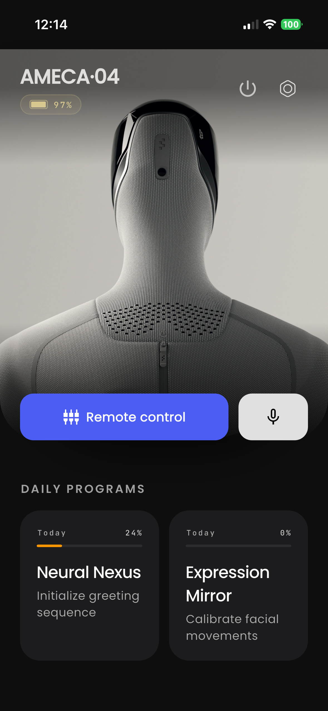
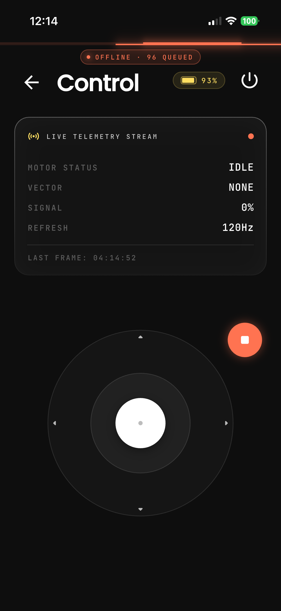
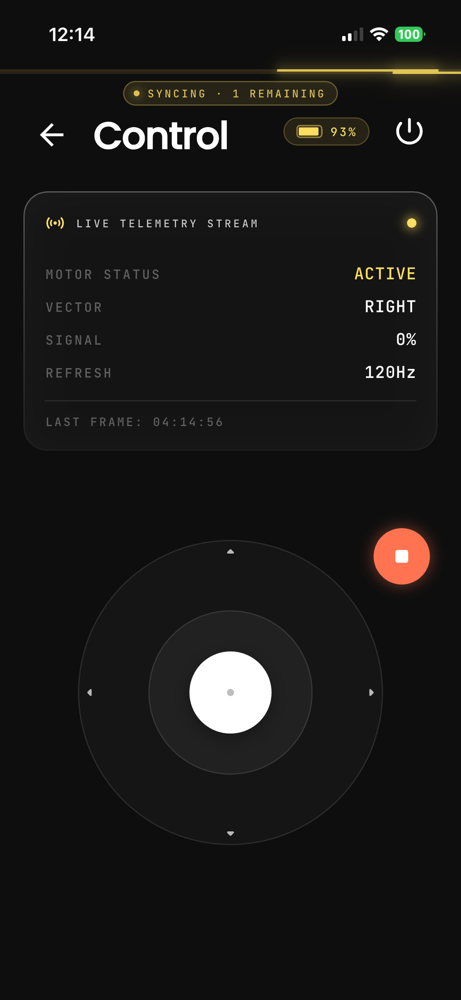
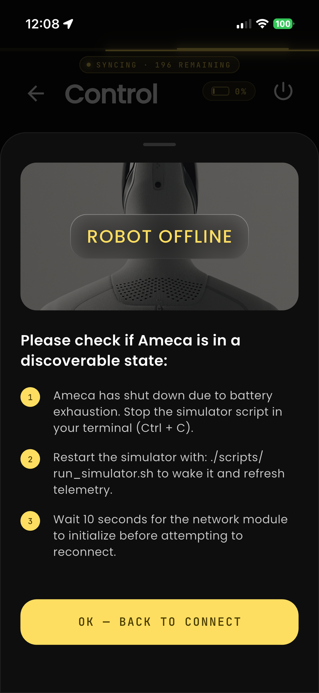
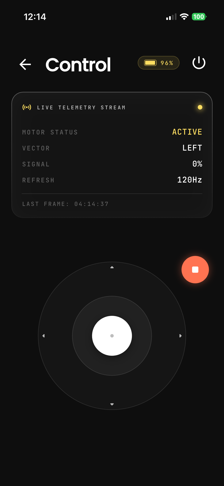
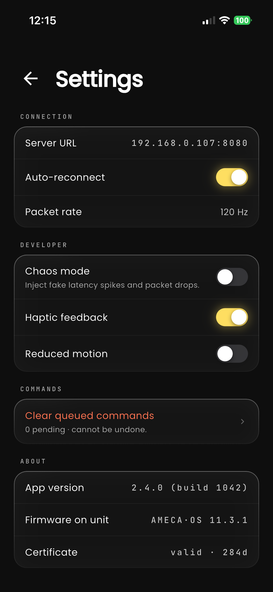

# Ameca·Ctrl - Engineered Arts Robot Tech Test

This repository contains the solution for the Mobile Engineer tech test. It is a Flutter application designed to remotely control and monitor a simulated robot device.

The project demonstrates:
- A scalable, modular architecture (Clean Architecture, Monorepo).
- Robust state management (BLoC).
- Graceful handling of intermittent connectivity and offline command queuing.
- Native device integration.

## 📱 App Showcase

*(Watch the full video demonstration: [demo_video.mp4](assets/showcase/demo_video.mp4))*

| Dashboard (Status) | Control (Disconnection) | Control (Queued Commands) |
|:---:|:---:|:---:|
|  |  |  |

|  Beattery dead Offline | Control Screen | Settings Screen |
|:---:|:---:|:---:|
|  |  |  |

**Breakdown of UI interactions:**
- **Splash & Connect**: The initial launch seamlessly transitions into the manual IP pairing screen to configure the simulator URL.
- **Dashboard (Telemetry)**: A live view reading the 1Hz WebSocket stream to display real-time battery voltage alongside polished 3D assets.
- **Control**: An interactive directional pad routing synchronous `POST /move` and `POST /stop` intents.
- **Offline Reconnection**: When the Wi-Fi drops or the backend simulator triggers `--chaos` mode crashes, an active "Reconnecting... X seconds" banner appears. Movements hit an offline queue.
- **Battery Dead Edge-case**: If the simulator completely drains to 0%, the UI automatically locks into a mandatory sheet forcing a device disconnect.

## 🏗️ Architecture and State Management

### Project Structure (Monorepo)
The project is structured as a monorepo managed by [Melos](https://melos.invertase.dev/), divided into specialized packages:
- **`app/`**: The Flutter presentation layer containing UI, routing, and native platform integrations.
- **`robot_service/`**: The core business logic, adhering to Domain-Driven Design (DDD) and Clean Architecture principles. It contains three layers:
  - *Domain*: Interfaces and models (`RobotStatus`, `RobotCommand`).
  - *Application*: State management using the BLoC pattern (`RobotConnectionBloc`, `RobotTelemetryBloc`, `RobotCommandBloc`).
  - *Infrastructure*: API clients, WebSocket streams, and offline queueing (SharedPreferences).
- **`design_system/`**: A separate package for UI components, theming, colors, and typography, ensuring consistent design across the app.
- **`robot_simulator/`**: A lightweight local backend written in Dart (using Shelf) that acts as the simulated robot device.

### Monorepo Management (Melos & Workspace Resolution)
This project uses [Melos](https://melos.invertase.dev/) and Dart 3.5+ workspace features to manage the multi-package setup. This provides several key benefits:
1. **Shared Dependencies**: Using a unified root `pubspec.yaml` (workspace resolution), all internal packages share the exact same dependency versions. This prevents version resolution conflicts across packages and drastically reduces `pub get` times.
2. **Unified Tooling**: Running tests, code generation, and analyzing across all packages can be done with a single command (e.g., `melos run build:codegen:build:all`).
3. **Strict Boundaries**: Splitting the codebase into separate packages strictly enforces architectural boundaries, ensuring that core business logic (`robot_service`) cannot accidentally import Flutter UI libraries.

### State Management
We use the **BLoC (Business Logic Component)** pattern (`flutter_bloc`) to manage state predictably and scalably:
1. **`RobotConnectionBloc`**: Manages the connection lifecycle (connecting, connected, disconnected, connection failed).
2. **`RobotTelemetryBloc`**: Subscribes to the live telemetry WebSocket stream, pushing real-time `live` and `stale` states to the UI.
3. **`RobotCommandBloc`**: Handles user intents (Move/Stop). If offline, it defers to the `OfflineCommandQueue` and flushes them upon reconnection.

## 📡 Assumptions

1. **API Behavior**: The robot communicates over an HTTP REST API for commands (Connect, Disconnect, Move, Stop) and a WebSocket (`/ws/telemetry`) for real-time status and battery updates.
2. **Command Lifecycles**: A "Stop" command is treated with higher priority than "Move". If the app comes back online, issuing a queued "Stop" will supersede and clear any pending "Move" commands.
3. **Network**: Connectivity drops are common. The app actively monitors WebSocket health and ping failures to detect disconnection, moving into a `stale` state if the telemetry stream drops.
4. **Trust/Security**: For this simulated tech test, pairing is done via a manual local IP/URL entry without OAuth or TLS cert pinning.

## 🚀 Native Integration (Bonus)

- **Android Foreground Service**: To ensure the user can instantly stop the robot even if the app is backgrounded, an Android Foreground Service is implemented. It displays an ongoing notification with a quick-action "Stop" button while the robot is moving. 
*(Note: An iOS Live Activity widget was originally explored but removed to ensure smooth cross-platform portability without requiring paid Apple Developer provisioning profiles).*

## 🔌 Handling Intermittent Connectivity

- **API Retries**: HTTP requests use a 3x exponential backoff strategy with a 5s per-attempt timeout.
- **WebSocket Reconnects**: Automatically attempts to reconnect the telemetry stream with an exponential backoff capped at 30 seconds.
- **Offline Command Queue**: If a user sends a movement command while the WebSocket/network is down, the command is persisted locally. Once the connection is re-established, the queue is flushed to the simulated API in FIFO order.
- **UI Feedback**: The UI immediately reflects `stale` states (greyed out or warning indicators) if telemetry is lost.

## 🛠️ Instructions for Running

### Prerequisites
- Flutter SDK (3.24+) & Dart (3.5+)
- An Android Emulator, iOS Simulator, or physical device.
- [Melos](https://melos.invertase.dev/): Install via `dart pub global activate melos`

### 1. Initial Setup
Run the following from the root of the workspace to install dependencies and generate required code (Freezed, JSON Serializable, AutoRoute, Injectable):
```bash
melos bootstrap
melos run build:codegen:build:all
```

### 2. Start the Simulated API
The simulator is a pure-Dart server. Start it in a separate terminal window from the project root:
```bash
sh scripts/run_simulator.sh --port 8080 --chaos --latency 50
```
- `--chaos` randomly drops connections and fails 5% of commands to test resilience.
- `--latency 50` adds a 50ms artificial delay.

### 3. Run the Flutter App
Open a new terminal and run your desired platform script:
```bash
sh scripts/run_dev_android.sh
# OR
sh scripts/run_dev_ios.sh
```
*Alternatively, you can navigate to the `app/` directory and run `flutter run` manually.*

**Connection URL**: 
- If running on an **iOS Simulator**, enter: `http://127.0.0.1:8080`
- If running on an **Android Emulator**, enter: `http://10.0.2.2:8080`
- If using a physical device, enter your computer's local LAN IP (e.g., `http://192.168.x.x:8080`).

## 🧪 Testing

The project includes unit and bloc tests, verifying state transitions and the offline queue logic.
Run all tests workspace-wide using Melos:
```bash
melos run test:unit
```

## 🔮 Future Production Improvements

If this were moving to a production environment, here are several improvements that should be considered:
1. **Security**: Implement mTLS (Mutual TLS) for robot-device pairing, enforce HTTPS/WSS, and add certificate pinning to prevent MITM attacks.
2. **Protocol Efficiency**: Replace JSON over REST/WebSockets with gRPC/Protobuf for lower latency, smaller payload sizes, and strictly typed multi-language contracts.
3. **Observability**: Integrate Sentry (Crashlytics) and OpenTelemetry/Datadog to monitor real-time command latency and failure rates in the wild.
4. **E2E Testing**: Add Maestro or integration_test suites to run fully automated end-to-end UI tests checking offline-to-online reconnection flows.
5. **Fleet Management**: Extend the connection flow to support discovering and managing multiple robots (e.g., via mDNS or Bluetooth LE).
